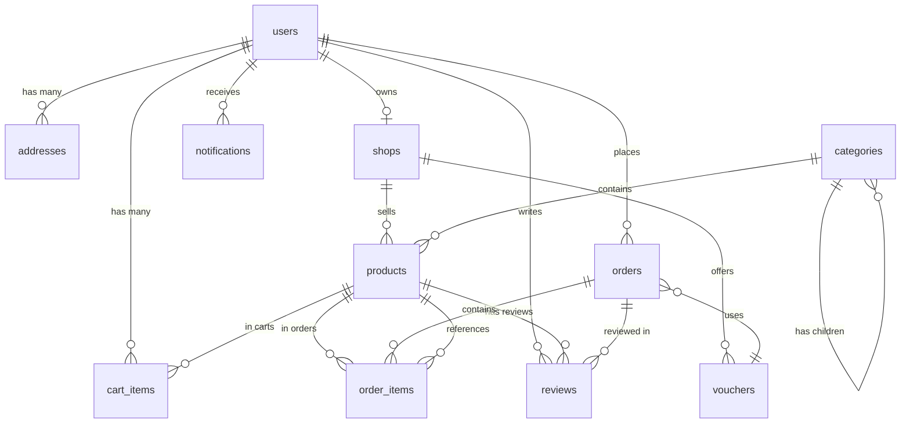

# Database Schema Documentation

This document describes the database schema for the E-Commerce Marketplace platform.

## Overview

The database uses **PostgreSQL 14+** with **SQLAlchemy 2.0** async ORM. All models use UUID primary keys and include timestamp fields (`created_at`, `updated_at`).

## Tables

### 1. users

User accounts for customers, sellers, and administrators.

| Column | Type | Constraints | Description |
|--------|------|-------------|-------------|
| id | UUID | PK | Primary key |
| email | VARCHAR(255) | UNIQUE, NOT NULL | User email |
| phone_number | VARCHAR(20) | UNIQUE, NOT NULL | Phone number |
| hashed_password | VARCHAR(255) | NOT NULL | Bcrypt hashed password |
| full_name | VARCHAR(255) | NOT NULL | User's full name |
| role | ENUM | NOT NULL | CUSTOMER, SELLER, or ADMIN |
| is_verified | BOOLEAN | DEFAULT false | Email verification status |
| is_suspended | BOOLEAN | DEFAULT false | Account suspension status |
| created_at | TIMESTAMP | NOT NULL | Account creation time |
| updated_at | TIMESTAMP | NOT NULL | Last update time |

**Indexes**:
- `idx_users_email` on `email`
- `idx_users_phone` on `phone_number`
- `idx_users_role` on `role`

**Relationships**:
- One-to-many with `addresses`
- One-to-one with `shops` (if seller)
- One-to-many with `orders` (as buyer)
- One-to-many with `reviews`
- One-to-many with `notifications`

### 2. shops

Seller shop information.

| Column | Type | Constraints | Description |
|--------|------|-------------|-------------|
| id | UUID | PK | Primary key |
| owner_id | UUID | FK(users.id), UNIQUE, NOT NULL | Shop owner reference |
| name | VARCHAR(255) | NOT NULL | Shop name |
| description | TEXT | | Shop description |
| address | TEXT | | Physical address |
| is_active | BOOLEAN | DEFAULT false | Approval status |
| created_at | TIMESTAMP | NOT NULL | Shop creation time |
| updated_at | TIMESTAMP | NOT NULL | Last update time |

**Indexes**:
- `idx_shops_owner_id` on `owner_id`
- `idx_shops_is_active` on `is_active`

**Relationships**:
- Many-to-one with `users` (owner)
- One-to-many with `products`
- One-to-many with `vouchers`

### 3. categories

Product categories with hierarchical structure.

| Column | Type | Constraints | Description |
|--------|------|-------------|-------------|
| id | UUID | PK | Primary key |
| name | VARCHAR(255) | NOT NULL | Category name |
| description | TEXT | | Category description |
| parent_id | UUID | FK(categories.id), NULL | Parent category (NULL for top-level) |
| created_at | TIMESTAMP | NOT NULL | Creation time |
| updated_at | TIMESTAMP | NOT NULL | Last update time |

**Indexes**:
- `idx_categories_parent_id` on `parent_id`

**Relationships**:
- Self-referential: parent/children categories
- One-to-many with `products`

### 4. products

Product listings.

| Column | Type | Constraints | Description |
|--------|------|-------------|-------------|
| id | UUID | PK | Primary key |
| shop_id | UUID | FK(shops.id), NOT NULL | Shop reference |
| category_id | UUID | FK(categories.id), NOT NULL | Category reference |
| name | VARCHAR(255) | NOT NULL | Product name |
| description | TEXT | | Product description |
| price | NUMERIC(12,2) | NOT NULL | Product price |
| stock_quantity | INTEGER | DEFAULT 0 | Available stock |
| image_url | TEXT | | Product image URL |
| is_active | BOOLEAN | DEFAULT true | Product visibility |
| created_at | TIMESTAMP | NOT NULL | Creation time |
| updated_at | TIMESTAMP | NOT NULL | Last update time |

**Indexes**:
- `idx_products_shop_id` on `shop_id`
- `idx_products_category_id` on `category_id`
- `idx_products_is_active` on `is_active`
- `idx_products_name` on `name` (for search)

**Relationships**:
- Many-to-one with `shops`
- Many-to-one with `categories`
- One-to-many with `cart_items`
- One-to-many with `order_items`
- One-to-many with `reviews`

### 5. addresses

User shipping addresses.

| Column | Type | Constraints | Description |
|--------|------|-------------|-------------|
| id | UUID | PK | Primary key |
| user_id | UUID | FK(users.id), NOT NULL | User reference |
| full_name | VARCHAR(255) | NOT NULL | Recipient name |
| phone_number | VARCHAR(20) | NOT NULL | Contact phone |
| street_address | TEXT | NOT NULL | Street address |
| ward | VARCHAR(255) | NOT NULL | Ward/commune |
| district | VARCHAR(255) | NOT NULL | District |
| city | VARCHAR(255) | NOT NULL | City/province |
| is_default | BOOLEAN | DEFAULT false | Default address flag |
| created_at | TIMESTAMP | NOT NULL | Creation time |
| updated_at | TIMESTAMP | NOT NULL | Last update time |

**Indexes**:
- `idx_addresses_user_id` on `user_id`

**Relationships**:
- Many-to-one with `users`

### 6. cart_items

Shopping cart items (persistent).

| Column | Type | Constraints | Description |
|--------|------|-------------|-------------|
| id | UUID | PK | Primary key |
| user_id | UUID | FK(users.id), NOT NULL | User reference |
| product_id | UUID | FK(products.id), NOT NULL | Product reference |
| quantity | INTEGER | NOT NULL, CHECK > 0 | Item quantity |
| created_at | TIMESTAMP | NOT NULL | Added to cart time |
| updated_at | TIMESTAMP | NOT NULL | Last update time |

**Indexes**:
- `idx_cart_items_user_id` on `user_id`
- `idx_cart_items_product_id` on `product_id`
- Composite unique: `(user_id, product_id)`

**Relationships**:
- Many-to-one with `users`
- Many-to-one with `products`

### 7. orders

Customer orders.

| Column | Type | Constraints | Description |
|--------|------|-------------|-------------|
| id | UUID | PK | Primary key |
| user_id | UUID | FK(users.id), NOT NULL | Buyer reference |
| order_code | VARCHAR(50) | UNIQUE, NOT NULL | Order tracking code |
| status | ENUM | NOT NULL | PENDING, CONFIRMED, PROCESSING, SHIPPED, DELIVERED, CANCELLED |
| payment_method | ENUM | NOT NULL | COD, BANK_TRANSFER, E_WALLET |
| payment_status | ENUM | NOT NULL | PENDING, PAID, FAILED, REFUNDED |
| shipping_address | TEXT | NOT NULL | Full shipping address |
| shipping_phone | VARCHAR(20) | NOT NULL | Contact phone |
| subtotal | NUMERIC(12,2) | NOT NULL | Items total |
| shipping_fee | NUMERIC(12,2) | DEFAULT 0 | Shipping cost |
| discount_amount | NUMERIC(12,2) | DEFAULT 0 | Voucher discount |
| total_amount | NUMERIC(12,2) | NOT NULL | Final total |
| voucher_id | UUID | FK(vouchers.id), NULL | Applied voucher |
| notes | TEXT | | Order notes |
| created_at | TIMESTAMP | NOT NULL | Order creation time |
| updated_at | TIMESTAMP | NOT NULL | Last update time |

**Indexes**:
- `idx_orders_user_id` on `user_id`
- `idx_orders_status` on `status`
- `idx_orders_order_code` on `order_code`
- `idx_orders_created_at` on `created_at`

**Relationships**:
- Many-to-one with `users`
- One-to-many with `order_items`
- Many-to-one with `vouchers`
- One-to-many with `reviews`

### 8. order_items

Items within an order.

| Column | Type | Constraints | Description |
|--------|------|-------------|-------------|
| id | UUID | PK | Primary key |
| order_id | UUID | FK(orders.id), NOT NULL | Order reference |
| product_id | UUID | FK(products.id), NOT NULL | Product reference |
| quantity | INTEGER | NOT NULL, CHECK > 0 | Quantity ordered |
| price | NUMERIC(12,2) | NOT NULL | Price at time of order |
| subtotal | NUMERIC(12,2) | NOT NULL | Quantity × price |
| created_at | TIMESTAMP | NOT NULL | Creation time |
| updated_at | TIMESTAMP | NOT NULL | Last update time |

**Indexes**:
- `idx_order_items_order_id` on `order_id`
- `idx_order_items_product_id` on `product_id`

**Relationships**:
- Many-to-one with `orders`
- Many-to-one with `products`

### 9. vouchers

Discount vouchers (platform or shop-specific).

| Column | Type | Constraints | Description |
|--------|------|-------------|-------------|
| id | UUID | PK | Primary key |
| code | VARCHAR(50) | UNIQUE, NOT NULL | Voucher code |
| description | TEXT | | Voucher description |
| voucher_type | ENUM | NOT NULL | PLATFORM or SHOP |
| shop_id | UUID | FK(shops.id), NULL | Shop reference (if SHOP type) |
| discount_type | ENUM | NOT NULL | PERCENTAGE or FIXED_AMOUNT |
| discount_value | NUMERIC(12,2) | NOT NULL | Discount value |
| min_order_value | NUMERIC(12,2) | | Minimum order requirement |
| max_discount | NUMERIC(12,2) | | Maximum discount cap |
| usage_limit | INTEGER | | Total usage limit |
| times_used | INTEGER | DEFAULT 0 | Current usage count |
| start_date | TIMESTAMP | NOT NULL | Valid from |
| end_date | TIMESTAMP | NOT NULL | Valid until |
| is_active | BOOLEAN | DEFAULT true | Active status |
| created_at | TIMESTAMP | NOT NULL | Creation time |
| updated_at | TIMESTAMP | NOT NULL | Last update time |

**Indexes**:
- `idx_vouchers_code` on `code`
- `idx_vouchers_shop_id` on `shop_id`
- `idx_vouchers_is_active` on `is_active`

**Relationships**:
- Many-to-one with `shops` (optional)
- One-to-many with `orders`

### 10. reviews

Product reviews and ratings.

| Column | Type | Constraints | Description |
|--------|------|-------------|-------------|
| id | UUID | PK | Primary key |
| user_id | UUID | FK(users.id), NOT NULL | Reviewer reference |
| product_id | UUID | FK(products.id), NOT NULL | Product reference |
| order_id | UUID | FK(orders.id), NOT NULL | Order reference |
| rating | INTEGER | NOT NULL, CHECK 1-5 | Star rating |
| comment | TEXT | | Review text |
| created_at | TIMESTAMP | NOT NULL | Review time |
| updated_at | TIMESTAMP | NOT NULL | Last update time |

**Indexes**:
- `idx_reviews_product_id` on `product_id`
- `idx_reviews_user_id` on `user_id`
- `idx_reviews_order_id` on `order_id`
- Composite unique: `(user_id, product_id)`

**Relationships**:
- Many-to-one with `users`
- Many-to-one with `products`
- Many-to-one with `orders`

### 11. notifications

User notifications.

| Column | Type | Constraints | Description |
|--------|------|-------------|-------------|
| id | UUID | PK | Primary key |
| user_id | UUID | FK(users.id), NOT NULL | User reference |
| type | ENUM | NOT NULL | ORDER_UPDATE, MESSAGE, PROMOTION, SYSTEM |
| title | VARCHAR(255) | NOT NULL | Notification title |
| message | TEXT | NOT NULL | Notification message |
| related_entity_type | VARCHAR(50) | | Entity type (order, product) |
| related_entity_id | UUID | | Entity reference |
| metadata | JSONB | | Additional data |
| is_read | BOOLEAN | DEFAULT false | Read status |
| created_at | TIMESTAMP | NOT NULL | Notification time |

**Indexes**:
- `idx_notifications_user_id` on `user_id`
- `idx_notifications_type` on `type`
- Composite: `(user_id, is_read, created_at)` for efficient queries

**Relationships**:
- Many-to-one with `users`

## Entity Relationship Diagram



## Database Migrations

The project uses Alembic for version-controlled schema migrations. All migrations are located in `alembic/versions/`.

### Migration History

1. `create_users_table.py` - User accounts and authentication
2. `create_shops_table.py` - Seller shops
3. `create_categories_table.py` - Product categories
4. `create_products_table.py` - Product catalog
5. `create_addresses_table.py` - Shipping addresses
6. `create_cart_items_table.py` - Shopping cart
7. `create_orders_table.py` - Orders and order items
8. `create_vouchers_table.py` - Discount vouchers
9. `create_reviews_table.py` - Product reviews
10. `create_notifications_table.py` - User notifications

### Running Migrations

```bash
# Apply all migrations
alembic upgrade head

# Rollback one migration
alembic downgrade -1

# View migration history
alembic history

# Create new migration
alembic revision --autogenerate -m "description"
```

## Indexes Strategy

### Search Optimization
- `products.name` - Full-text search on product names
- `categories.name` - Category search
- `users.email`, `users.phone_number` - User lookup

### Foreign Key Performance
- All foreign key columns have indexes
- Composite indexes for common query patterns

### Filtering & Sorting
- `products.is_active` - Active product filtering
- `orders.created_at` - Order history sorting
- `orders.status` - Order status filtering
- `notifications(user_id, is_read, created_at)` - Unread notifications

## Data Constraints

### Business Rules
- Users can have only one shop (UNIQUE on `shops.owner_id`)
- Cart items are unique per user-product combination
- Reviews are unique per user-product combination
- Order codes are globally unique
- Voucher codes are globally unique

### Data Integrity
- Cascade deletes: User deletion removes their addresses, cart, orders, reviews, notifications
- Shop deletion removes products and shop vouchers
- Product deletion removes cart items and order items (archived)
- Order items preserve product_id even if product is deleted (soft delete)

## Performance Considerations

### Query Optimization
- Use eager loading for relationships to avoid N+1 queries
- Pagination on all list endpoints (offset-based)
- Composite indexes for common filter combinations
- JSONB for flexible metadata storage

### Connection Pooling
```python
# SQLAlchemy async engine with pool
engine = create_async_engine(
    DATABASE_URL,
    echo=DEBUG,
    pool_size=10,
    max_overflow=20
)
```

### Caching Strategy
- Product catalog: Cache frequently accessed products
- Categories: Cache entire category tree
- User sessions: Redis for session storage (future)

## Backup & Recovery

### Backup Strategy
```bash
# Full database backup
pg_dump -h localhost -U postgres -d marketplace > backup_$(date +%Y%m%d).sql

# Restore from backup
psql -h localhost -U postgres -d marketplace < backup_20240115.sql
```

### Point-in-Time Recovery
Enable WAL archiving in PostgreSQL for point-in-time recovery.

## Security

### Sensitive Data
- Passwords: Bcrypt hashed, never stored in plain text
- JWT tokens: Short-lived access tokens, refresh tokens for renewal
- API keys: Stored in environment variables, not in database

### Access Control
- Row-level security: Users can only access their own data
- Admin privileges: Separate role-based access control
- Shop access: Sellers can only manage their own shop

## Monitoring

### Key Metrics
- Active connections: Monitor pool usage
- Slow queries: Log queries > 1 second
- Table sizes: Monitor growth trends
- Index usage: Check index hit rates

```sql
-- Monitor table sizes
SELECT 
    schemaname,
    tablename,
    pg_size_pretty(pg_total_relation_size(schemaname||'.'||tablename)) AS size
FROM pg_tables
WHERE schemaname = 'public'
ORDER BY pg_total_relation_size(schemaname||'.'||tablename) DESC;

-- Check index usage
SELECT 
    schemaname,
    tablename,
    indexname,
    idx_scan as index_scans
FROM pg_stat_user_indexes
ORDER BY idx_scan ASC;
```

---

**Last Updated**: December 2025  
**Schema Version**: Alembic revision head
