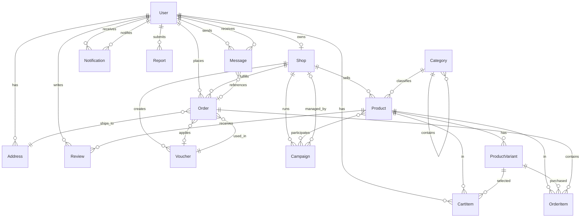

# Phase 1a: Data Model

**Feature**: Multi-Vendor E-Commerce Marketplace  
**Branch**: `001-ecommerce-marketplace`  
**Date**: 2025-12-03  
**Purpose**: Define all entities, relationships, state transitions, and business rules for the MVP implementation.

---

## Entity Definitions

### 1. User

**Purpose**: Represents all platform users with role-based access (Guest, Buyer, Seller, Admin).

**Fields**:
| Field | Type | Constraints | Description |
|-------|------|-------------|-------------|
| `id` | String (UUID) | PRIMARY KEY, NOT NULL | Unique user identifier |
| `phoneNumber` | String | UNIQUE, NOT NULL | Authentication credential (Vietnamese phone: +84...) |
| `email` | String | UNIQUE, NULLABLE | Optional email for notifications |
| `passwordHash` | String | NOT NULL | Hashed password (bcrypt) |
| `fullName` | String | NOT NULL | Display name |
| `avatarUrl` | String | NULLABLE | Profile picture URL (cloud storage) |
| `role` | Enum | NOT NULL, DEFAULT 'BUYER' | `GUEST`, `BUYER`, `SELLER`, `ADMIN` |
| `isVerified` | Boolean | NOT NULL, DEFAULT false | OTP phone verification status |
| `isSuspended` | Boolean | NOT NULL, DEFAULT false | Admin ban flag |
| `createdAt` | DateTime | NOT NULL | Registration timestamp |
| `updatedAt` | DateTime | NOT NULL | Last profile update timestamp |

**Relationships**:
- `addresses`: One-to-Many → `Address` (user can have multiple shipping addresses)
- `shop`: One-to-One → `Shop` (nullable, created when user becomes seller)
- `orders`: One-to-Many → `Order` (buyer orders)
- `reviews`: One-to-Many → `Review` (buyer reviews)
- `cartItems`: One-to-Many → `CartItem` (current cart state)
- `sentMessages`: One-to-Many → `Message` (as sender)
- `receivedMessages`: One-to-Many → `Message` (as receiver)
- `notifications`: One-to-Many → `Notification`
- `reports`: One-to-Many → `Report` (as reporter)

**Business Rules**:
- Phone number must be unique and verified before first purchase
- Role `SELLER` requires creating a `Shop` entity
- Role `ADMIN` grants access to platform administration features
- Suspended users cannot place orders or send messages

**State Transitions**:
```
[GUEST] ──register──> [BUYER]
[BUYER] ──create shop──> [SELLER]
[BUYER/SELLER] ──admin action──> [ADMIN]
[any] ──admin suspend──> [SUSPENDED]
```

---

### 2. Address

**Purpose**: Stores shipping addresses for buyers.

**Fields**:
| Field | Type | Constraints | Description |
|-------|------|-------------|-------------|
| `id` | String (UUID) | PRIMARY KEY, NOT NULL | Unique address identifier |
| `userId` | String (UUID) | FOREIGN KEY, NOT NULL | References `User.id` |
| `recipientName` | String | NOT NULL | Name of person receiving delivery |
| `phoneNumber` | String | NOT NULL | Contact number for delivery |
| `streetAddress` | String | NOT NULL | Street, building, apartment details |
| `ward` | String | NOT NULL | Vietnamese administrative unit (Phường/Xã) |
| `district` | String | NOT NULL | Vietnamese administrative unit (Quận/Huyện) |
| `city` | String | NOT NULL | Vietnamese city/province |
| `isDefault` | Boolean | NOT NULL, DEFAULT false | Default address for checkout |
| `createdAt` | DateTime | NOT NULL | Creation timestamp |

**Relationships**:
- `user`: Many-to-One → `User`
- `orders`: One-to-Many → `Order` (orders delivered to this address)

**Business Rules**:
- Each user must have at least one address to place orders
- Only one address per user can be marked as `isDefault`
- When creating first address, automatically set `isDefault = true`

---

### 3. Shop

**Purpose**: Seller's storefront with branding, ratings, and operational status.

**Fields**:
| Field | Type | Constraints | Description |
|-------|------|-------------|-------------|
| `id` | String (UUID) | PRIMARY KEY, NOT NULL | Unique shop identifier |
| `ownerId` | String (UUID) | FOREIGN KEY, UNIQUE, NOT NULL | References `User.id` (one shop per user) |
| `shopName` | String | UNIQUE, NOT NULL | Public shop name |
| `description` | String | NULLABLE | Shop bio/introduction |
| `logoUrl` | String | NULLABLE | Shop logo image (cloud storage) |
| `coverImageUrl` | String | NULLABLE | Shop banner image |
| `businessAddress` | String | NOT NULL | Physical shop/warehouse location |
| `rating` | Float | NOT NULL, DEFAULT 0.0 | Average shop rating (1.0 - 5.0) |
| `totalRatings` | Integer | NOT NULL, DEFAULT 0 | Count of ratings |
| `followerCount` | Integer | NOT NULL, DEFAULT 0 | Number of users following shop |
| `status` | Enum | NOT NULL, DEFAULT 'PENDING' | `PENDING`, `ACTIVE`, `SUSPENDED` |
| `createdAt` | DateTime | NOT NULL | Shop registration timestamp |
| `updatedAt` | DateTime | NOT NULL | Last update timestamp |

**Relationships**:
- `owner`: One-to-One → `User` (seller account)
- `products`: One-to-Many → `Product` (shop's product listings)
- `orders`: One-to-Many → `Order` (orders containing shop products)
- `vouchers`: One-to-Many → `Voucher` (shop-created discount codes)
- `followers`: Many-to-Many → `User` (users following shop)

**Business Rules**:
- Shop requires admin approval to transition from `PENDING` to `ACTIVE`
- Only `ACTIVE` shops can list products and receive orders
- Shop `rating` recalculated on each new product review
- Suspended shops cannot process new orders

**State Transitions**:
```
[registration] ──> [PENDING] ──admin approve──> [ACTIVE]
[ACTIVE] ──admin suspend──> [SUSPENDED]
[SUSPENDED] ──admin reinstate──> [ACTIVE]
```

---

### 4. Category

**Purpose**: Hierarchical product classification for navigation and filtering.

**Fields**:
| Field | Type | Constraints | Description |
|-------|------|-------------|-------------|
| `id` | String (UUID) | PRIMARY KEY, NOT NULL | Unique category identifier |
| `name` | String | NOT NULL | Category display name (Vietnamese) |
| `iconUrl` | String | NULLABLE | Category icon image |
| `parentId` | String (UUID) | FOREIGN KEY, NULLABLE | References `Category.id` (null for root) |
| `level` | Integer | NOT NULL | Hierarchy depth (0 = root, 1 = subcategory) |
| `sortOrder` | Integer | NOT NULL, DEFAULT 0 | Display order in lists |
| `isActive` | Boolean | NOT NULL, DEFAULT true | Visibility status |

**Relationships**:
- `parentCategory`: Many-to-One → `Category` (nullable for root categories)
- `subcategories`: One-to-Many → `Category` (children in hierarchy)
- `products`: One-to-Many → `Product` (products in this category)

**Business Rules**:
- Maximum 2 levels of hierarchy (root + subcategory)
- Root categories have `parentId = null` and `level = 0`
- Inactive categories are hidden from browsing but products remain accessible

**Examples**:
```
Electronics (root, level=0)
├── Smartphones (level=1, parentId=Electronics.id)
└── Laptops (level=1, parentId=Electronics.id)

Fashion (root, level=0)
├── Men's Clothing (level=1, parentId=Fashion.id)
└── Women's Clothing (level=1, parentId=Fashion.id)
```

---

### 5. Product

**Purpose**: Sellable items with pricing, stock, media, and variants.

**Fields**:
| Field | Type | Constraints | Description |
|-------|------|-------------|-------------|
| `id` | String (UUID) | PRIMARY KEY, NOT NULL | Unique product identifier |
| `shopId` | String (UUID) | FOREIGN KEY, NOT NULL | References `Shop.id` |
| `categoryId` | String (UUID) | FOREIGN KEY, NOT NULL | References `Category.id` |
| `title` | String | NOT NULL | Product name |
| `description` | String | NOT NULL | Detailed product description |
| `basePrice` | Decimal | NOT NULL, CHECK > 0 | Starting price in VND |
| `currency` | String | NOT NULL, DEFAULT 'VND' | Currency code |
| `totalStock` | Integer | NOT NULL, DEFAULT 0 | Total available units (sum of variants) |
| `images` | String[] | NOT NULL, MIN 1 | Array of image URLs (cloud storage) |
| `condition` | Enum | NOT NULL, DEFAULT 'NEW' | `NEW`, `USED`, `REFURBISHED` |
| `averageRating` | Float | NOT NULL, DEFAULT 0.0 | Average review rating (1.0 - 5.0) |
| `totalReviews` | Integer | NOT NULL, DEFAULT 0 | Count of reviews |
| `soldCount` | Integer | NOT NULL, DEFAULT 0 | Total units sold (for best-seller ranking) |
| `isActive` | Boolean | NOT NULL, DEFAULT true | Listing visibility |
| `createdAt` | DateTime | NOT NULL | Creation timestamp |
| `updatedAt` | DateTime | NOT NULL | Last update timestamp |

**Relationships**:
- `shop`: Many-to-One → `Shop` (product owner)
- `category`: Many-to-One → `Category` (classification)
- `variants`: One-to-Many → `ProductVariant` (size/color options)
- `reviews`: One-to-Many → `Review` (buyer feedback)
- `cartItems`: One-to-Many → `CartItem` (in-cart references)
- `orderItems`: One-to-Many → `OrderItem` (purchase history)

**Business Rules**:
- Must have at least 1 image (max 10 images)
- `basePrice` used as display price unless variants exist
- If variants exist, `totalStock` = sum of all variant stocks
- `averageRating` recalculated on each new review
- Inactive products hidden from search but accessible via direct link

**Computed Fields** (not stored in DB):
- `finalPrice`: Considers applied vouchers/discounts
- `isInStock`: `totalStock > 0`
- `ratingDistribution`: Count of 1-5 star reviews

---

### 6. ProductVariant

**Purpose**: Specific configurations of products (size, color, material) with individual pricing and stock.

**Fields**:
| Field | Type | Constraints | Description |
|-------|------|-------------|-------------|
| `id` | String (UUID) | PRIMARY KEY, NOT NULL | Unique variant identifier |
| `productId` | String (UUID) | FOREIGN KEY, NOT NULL | References `Product.id` |
| `name` | String | NOT NULL | Variant display name (e.g., "Red - Size M") |
| `attributes` | JSON | NOT NULL | Key-value pairs (e.g., `{"color": "Red", "size": "M"}`) |
| `sku` | String | UNIQUE, NULLABLE | Stock Keeping Unit for inventory tracking |
| `price` | Decimal | NOT NULL, CHECK > 0 | Variant-specific price in VND |
| `stock` | Integer | NOT NULL, DEFAULT 0, CHECK >= 0 | Available quantity for this variant |
| `isActive` | Boolean | NOT NULL, DEFAULT true | Availability status |

**Relationships**:
- `product`: Many-to-One → `Product` (parent product)
- `cartItems`: One-to-Many → `CartItem` (specific variant in cart)
- `orderItems`: One-to-Many → `OrderItem` (specific variant in orders)

**Business Rules**:
- Each product can have 0 variants (simple product) or multiple variants
- If no variants exist, use `Product.basePrice` and `Product.totalStock`
- Variant `attributes` JSON allows flexible attribute combinations
- Inactive variants hidden from selection but existing cart items remain valid

**Examples**:
```json
Product: "T-Shirt"
Variants:
- { "id": "v1", "name": "Red - Size M", "attributes": {"color": "Red", "size": "M"}, "price": 150000, "stock": 20 }
- { "id": "v2", "name": "Blue - Size L", "attributes": {"color": "Blue", "size": "L"}, "price": 160000, "stock": 15 }
```

---

### 7. Cart & CartItem

**Purpose**: Temporary shopping basket for buyers before checkout.

#### CartItem

**Fields**:
| Field | Type | Constraints | Description |
|-------|------|-------------|-------------|
| `id` | String (UUID) | PRIMARY KEY, NOT NULL | Unique cart item identifier |
| `userId` | String (UUID) | FOREIGN KEY, NOT NULL | References `User.id` |
| `productId` | String (UUID) | FOREIGN KEY, NOT NULL | References `Product.id` |
| `variantId` | String (UUID) | FOREIGN KEY, NULLABLE | References `ProductVariant.id` (null for simple product) |
| `quantity` | Integer | NOT NULL, CHECK > 0 | Number of units |
| `addedAt` | DateTime | NOT NULL | Timestamp when added to cart |

**Relationships**:
- `user`: Many-to-One → `User` (cart owner)
- `product`: Many-to-One → `Product`
- `variant`: Many-to-One → `ProductVariant` (nullable)

**Business Rules**:
- Cart persists across sessions (stored in local SQLite + backend sync)
- Quantity cannot exceed available stock (validated at checkout)
- If product/variant becomes inactive, cart item remains but shows warning
- Cart items automatically grouped by shop in UI

**Computed Fields** (not stored):
- `subtotal`: `quantity * (variant?.price ?? product.basePrice)`
- `shopId`: `product.shopId` (for grouping)

**Cart Aggregation** (no separate Cart entity, computed on-the-fly):
```dart
class Cart {
  final String userId;
  final List<CartItem> items;
  
  List<CartShopGroup> get groupedByShop; // Group items by product.shopId
  Decimal get grandTotal; // Sum of all item subtotals
  int get totalItems; // Sum of all quantities
}
```

---

### 8. Order

**Purpose**: Transaction record capturing buyer intent, payment, and fulfillment status.

**Fields**:
| Field | Type | Constraints | Description |
|-------|------|-------------|-------------|
| `id` | String (UUID) | PRIMARY KEY, NOT NULL | Unique order identifier |
| `orderNumber` | String | UNIQUE, NOT NULL | Human-readable order ID (e.g., "ORD-20231203-ABCD") |
| `buyerId` | String (UUID) | FOREIGN KEY, NOT NULL | References `User.id` (buyer) |
| `shopId` | String (UUID) | FOREIGN KEY, NOT NULL | References `Shop.id` (seller) |
| `addressId` | String (UUID) | FOREIGN KEY, NOT NULL | References `Address.id` (snapshot at order time) |
| `shippingAddress` | JSON | NOT NULL | Address snapshot (preserved if address deleted) |
| `status` | Enum | NOT NULL, DEFAULT 'PENDING' | Order lifecycle state (see state diagram below) |
| `paymentMethod` | Enum | NOT NULL | `COD` (future: `BANK_TRANSFER`, `E_WALLET`) |
| `paymentStatus` | Enum | NOT NULL, DEFAULT 'PENDING' | `PENDING`, `PAID`, `FAILED`, `REFUNDED` |
| `subtotal` | Decimal | NOT NULL | Sum of order item prices |
| `shippingFee` | Decimal | NOT NULL, DEFAULT 0 | Flat rate shipping cost (seller-defined) |
| `discount` | Decimal | NOT NULL, DEFAULT 0 | Applied voucher discount |
| `total` | Decimal | NOT NULL | `subtotal + shippingFee - discount` |
| `currency` | String | NOT NULL, DEFAULT 'VND' | Currency code |
| `voucherCode` | String | NULLABLE | Applied voucher code (if any) |
| `notes` | String | NULLABLE | Buyer notes to seller |
| `cancellationReason` | String | NULLABLE | Reason if order cancelled |
| `createdAt` | DateTime | NOT NULL | Order placement timestamp |
| `updatedAt` | DateTime | NOT NULL | Last status update timestamp |
| `completedAt` | DateTime | NULLABLE | Delivery completion timestamp |

**Relationships**:
- `buyer`: Many-to-One → `User` (buyer account)
- `shop`: Many-to-One → `Shop` (seller shop)
- `shippingAddressRef`: Many-to-One → `Address` (reference, but snapshot stored in JSON)
- `items`: One-to-Many → `OrderItem` (products in order)
- `appliedVoucher`: Many-to-One → `Voucher` (nullable)

**Business Rules**:
- `orderNumber` generated sequentially: `ORD-{YYYYMMDD}-{4-char-random}`
- Cart items grouped by shop create separate orders (multi-shop cart → multiple orders)
- `shippingAddress` stored as JSON snapshot to preserve historical data
- `status` transitions follow strict workflow (see state diagram)
- `paymentStatus` updated when order delivered (COD payment confirmed)
- Orders older than 30 days cannot be cancelled

**Order Status State Transitions**:
```
[PENDING] ──seller confirms──> [CONFIRMED]
[CONFIRMED] ──seller packs──> [PACKED]
[PACKED] ──seller ships──> [SHIPPING]
[SHIPPING] ──delivery completed──> [DELIVERED]
[DELIVERED] ──7 days auto-complete──> [COMPLETED]

[PENDING/CONFIRMED] ──buyer/seller cancels──> [CANCELLED]
[DELIVERED] ──buyer requests return──> [RETURN_REQUESTED]
[RETURN_REQUESTED] ──seller approves──> [RETURNED]
```

**Payment Status State Transitions**:
```
[PENDING] ──order delivered (COD)──> [PAID]
[PENDING] ──order cancelled──> [FAILED]
[PAID] ──return approved──> [REFUNDED]
```

---

### 9. OrderItem

**Purpose**: Line item in an order capturing product details at purchase time.

**Fields**:
| Field | Type | Constraints | Description |
|-------|------|-------------|-------------|
| `id` | String (UUID) | PRIMARY KEY, NOT NULL | Unique order item identifier |
| `orderId` | String (UUID) | FOREIGN KEY, NOT NULL | References `Order.id` |
| `productId` | String (UUID) | FOREIGN KEY, NOT NULL | References `Product.id` (snapshot) |
| `variantId` | String (UUID) | FOREIGN KEY, NULLABLE | References `ProductVariant.id` (snapshot) |
| `productSnapshot` | JSON | NOT NULL | Product details at order time (title, image, price) |
| `variantSnapshot` | JSON | NULLABLE | Variant details if applicable |
| `quantity` | Integer | NOT NULL, CHECK > 0 | Number of units purchased |
| `unitPrice` | Decimal | NOT NULL | Price per unit at order time |
| `subtotal` | Decimal | NOT NULL | `quantity * unitPrice` |
| `currency` | String | NOT NULL, DEFAULT 'VND' | Currency code |

**Relationships**:
- `order`: Many-to-One → `Order` (parent order)
- `productRef`: Many-to-One → `Product` (reference only, snapshot stored in JSON)
- `variantRef`: Many-to-One → `ProductVariant` (reference only)

**Business Rules**:
- Snapshot `productSnapshot` and `variantSnapshot` preserve product details at purchase time
- If product deleted later, order item retains historical data
- `unitPrice` may differ from current product price (captures price at order time)

**Snapshot JSON Structure**:
```json
{
  "productSnapshot": {
    "title": "Wireless Headphones",
    "imageUrl": "https://cdn.example.com/product1.jpg",
    "categoryName": "Electronics > Audio"
  },
  "variantSnapshot": {
    "name": "Black - Bluetooth 5.0",
    "attributes": {"color": "Black", "connectivity": "Bluetooth 5.0"}
  }
}
```

---

### 10. Review

**Purpose**: Buyer feedback on purchased products with ratings and optional media.

**Fields**:
| Field | Type | Constraints | Description |
|-------|------|-------------|-------------|
| `id` | String (UUID) | PRIMARY KEY, NOT NULL | Unique review identifier |
| `productId` | String (UUID) | FOREIGN KEY, NOT NULL | References `Product.id` |
| `userId` | String (UUID) | FOREIGN KEY, NOT NULL | References `User.id` (buyer) |
| `orderId` | String (UUID) | FOREIGN KEY, NOT NULL | References `Order.id` (verified purchase) |
| `rating` | Integer | NOT NULL, CHECK 1-5 | Star rating (1 to 5) |
| `content` | String | NULLABLE | Review text |
| `images` | String[] | NULLABLE | Review photos (max 5) |
| `isVerifiedPurchase` | Boolean | NOT NULL, DEFAULT true | Badge indicator |
| `isVisible` | Boolean | NOT NULL, DEFAULT true | Moderation flag (admin can hide) |
| `createdAt` | DateTime | NOT NULL | Review submission timestamp |
| `updatedAt` | DateTime | NOT NULL | Last edit timestamp |

**Relationships**:
- `product`: Many-to-One → `Product` (reviewed product)
- `user`: Many-to-One → `User` (reviewer)
- `order`: Many-to-One → `Order` (verified purchase proof)

**Business Rules**:
- Only buyers who purchased product can leave reviews (verified via `orderId`)
- One review per user per product (composite unique constraint: `userId + productId`)
- Reviews can be edited within 30 days of creation
- Admin can hide inappropriate reviews (`isVisible = false`)
- Product `averageRating` and `totalReviews` updated on create/update/delete

**Computed Fields**:
- Shop rating: Average of all product reviews for shop's products

---

### 11. Voucher

**Purpose**: Discount codes created by sellers to incentivize purchases.

**Fields**:
| Field | Type | Constraints | Description |
|-------|------|-------------|-------------|
| `id` | String (UUID) | PRIMARY KEY, NOT NULL | Unique voucher identifier |
| `shopId` | String (UUID) | FOREIGN KEY, NOT NULL | References `Shop.id` (voucher owner) |
| `code` | String | UNIQUE, NOT NULL | Discount code (e.g., "SALE20") |
| `title` | String | NOT NULL | Display name (e.g., "20% off orders above 500k") |
| `description` | String | NULLABLE | Usage terms and conditions |
| `type` | Enum | NOT NULL | `PERCENTAGE`, `FIXED_AMOUNT` |
| `value` | Decimal | NOT NULL, CHECK > 0 | Discount value (20 for 20%, or fixed VND amount) |
| `minOrderValue` | Decimal | NULLABLE | Minimum order subtotal to apply voucher |
| `maxDiscount` | Decimal | NULLABLE | Maximum discount cap (for percentage type) |
| `usageLimit` | Integer | NULLABLE | Total usage limit (null = unlimited) |
| `usageCount` | Integer | NOT NULL, DEFAULT 0 | Current usage count |
| `startDate` | DateTime | NOT NULL | Voucher validity start |
| `endDate` | DateTime | NOT NULL | Voucher validity end |
| `isActive` | Boolean | NOT NULL, DEFAULT true | Seller can deactivate early |

**Relationships**:
- `shop`: Many-to-One → `Shop` (voucher creator)
- `orders`: One-to-Many → `Order` (orders using this voucher)

**Business Rules**:
- `code` must be unique across platform (case-insensitive)
- Voucher valid only if: `isActive = true` AND `startDate <= now <= endDate` AND `usageCount < usageLimit`
- For `PERCENTAGE` type: `discount = min(orderSubtotal * value / 100, maxDiscount)`
- For `FIXED_AMOUNT` type: `discount = value`
- Order subtotal must be >= `minOrderValue` to apply voucher
- `usageCount` incremented when order placed successfully

**Validation Logic**:
```dart
bool canApplyVoucher(Voucher voucher, Decimal orderSubtotal) {
  if (!voucher.isActive) return false;
  if (DateTime.now().isBefore(voucher.startDate) || DateTime.now().isAfter(voucher.endDate)) return false;
  if (voucher.usageLimit != null && voucher.usageCount >= voucher.usageLimit!) return false;
  if (voucher.minOrderValue != null && orderSubtotal < voucher.minOrderValue!) return false;
  return true;
}
```

---

### 12. Message

**Purpose**: Real-time chat messages between buyers and sellers.

**Fields**:
| Field | Type | Constraints | Description |
|-------|------|-------------|-------------|
| `id` | String (UUID) | PRIMARY KEY, NOT NULL | Unique message identifier |
| `senderId` | String (UUID) | FOREIGN KEY, NOT NULL | References `User.id` (sender) |
| `receiverId` | String (UUID) | FOREIGN KEY, NOT NULL | References `User.id` (receiver) |
| `orderId` | String (UUID) | FOREIGN KEY, NULLABLE | References `Order.id` (order context) |
| `content` | String | NOT NULL | Message text |
| `type` | Enum | NOT NULL, DEFAULT 'TEXT' | `TEXT`, `IMAGE`, `ORDER_INFO` |
| `imageUrl` | String | NULLABLE | Image URL if type = IMAGE |
| `orderSnapshot` | JSON | NULLABLE | Order summary if type = ORDER_INFO |
| `isRead` | Boolean | NOT NULL, DEFAULT false | Read receipt |
| `createdAt` | DateTime | NOT NULL | Message timestamp |

**Relationships**:
- `sender`: Many-to-One → `User` (message sender)
- `receiver`: Many-to-One → `User` (message receiver)
- `orderRef`: Many-to-One → `Order` (nullable, for order-related chat)

**Business Rules**:
- Messages sent via WebSocket, stored in database for history
- Chat grouped by conversation (sender-receiver pair)
- If `orderId` present, display order card in chat UI
- `isRead` flag updated when receiver opens chat thread
- Messages persisted in local SQLite for offline viewing (last 7 days)

**WebSocket Protocol**:
```json
// Client → Server
{
  "action": "SEND_MESSAGE",
  "payload": {
    "receiverId": "uuid",
    "content": "Hello!",
    "orderId": "uuid" // optional
  }
}

// Server → Client (receiver)
{
  "event": "NEW_MESSAGE",
  "payload": {
    "id": "uuid",
    "senderId": "uuid",
    "content": "Hello!",
    "createdAt": "2023-12-03T10:00:00Z"
  }
}
```

---

### 13. Notification

**Purpose**: System-generated alerts for users about events (orders, messages, promotions).

**Fields**:
| Field | Type | Constraints | Description |
|-------|------|-------------|-------------|
| `id` | String (UUID) | PRIMARY KEY, NOT NULL | Unique notification identifier |
| `userId` | String (UUID) | FOREIGN KEY, NOT NULL | References `User.id` (recipient) |
| `type` | Enum | NOT NULL | `ORDER_UPDATE`, `MESSAGE`, `PROMOTION`, `SYSTEM` |
| `title` | String | NOT NULL | Notification headline |
| `message` | String | NOT NULL | Notification body text |
| `relatedEntityType` | String | NULLABLE | Entity type (e.g., "Order", "Product") |
| `relatedEntityId` | String (UUID) | NULLABLE | Entity ID for deep linking |
| `isRead` | Boolean | NOT NULL, DEFAULT false | Read status |
| `createdAt` | DateTime | NOT NULL | Notification timestamp |

**Relationships**:
- `user`: Many-to-One → `User` (notification recipient)

**Business Rules**:
- Notifications triggered by events: order status change, new message, voucher expiry
- If `relatedEntityType` and `relatedEntityId` present, tap notification navigates to entity (deep link)
- Unread count displayed in app badge and notification center
- Notifications older than 30 days auto-archived

**Notification Templates**:
| Type | Template Example | Related Entity |
|------|------------------|----------------|
| `ORDER_UPDATE` | "Your order #ORD-123 is now **Shipping**" | Order |
| `MESSAGE` | "**Shop ABC** sent you a message" | Message |
| `PROMOTION` | "Flash Sale: 50% off Electronics today!" | Campaign |
| `SYSTEM` | "Your review was submitted successfully" | Review |

**Firebase Cloud Messaging Integration**:
- Push notification sent to user's device when new notification created
- FCM token stored in `User` table (device registration)
- Background handler shows OS-level notification, tap opens app

---

### 14. Campaign

**Purpose**: Platform or shop-level promotional events (flash sales, free shipping campaigns).

**Fields**:
| Field | Type | Constraints | Description |
|-------|------|-------------|-------------|
| `id` | String (UUID) | PRIMARY KEY, NOT NULL | Unique campaign identifier |
| `shopId` | String (UUID) | FOREIGN KEY, NULLABLE | References `Shop.id` (null = platform-wide) |
| `title` | String | NOT NULL | Campaign name (e.g., "12.12 Flash Sale") |
| `description` | String | NULLABLE | Campaign details |
| `bannerImageUrl` | String | NULLABLE | Campaign banner for homepage |
| `type` | Enum | NOT NULL | `FLASH_SALE`, `FREE_SHIPPING`, `VOUCHER_DROP` |
| `startDate` | DateTime | NOT NULL | Campaign start timestamp |
| `endDate` | DateTime | NOT NULL | Campaign end timestamp |
| `isActive` | Boolean | NOT NULL, DEFAULT true | Admin/seller can deactivate |
| `createdAt` | DateTime | NOT NULL | Creation timestamp |

**Relationships**:
- `shop`: Many-to-One → `Shop` (nullable for platform campaigns)
- `products`: Many-to-Many → `Product` (participating products via join table)

**Business Rules**:
- Campaign active if: `isActive = true` AND `startDate <= now <= endDate`
- Flash sale products show countdown timer in UI
- Participating products have discounted prices during campaign
- Platform campaigns (shopId = null) managed by admins only

**Join Table: CampaignProduct**:
| Field | Type | Description |
|-------|------|-------------|
| `campaignId` | UUID | References `Campaign.id` |
| `productId` | UUID | References `Product.id` |
| `discountPercentage` | Decimal | Flash sale discount (e.g., 30 for 30% off) |
| `stockLimit` | Integer | Limited quantity for flash sale |

---

### 15. Report

**Purpose**: User-submitted flags for inappropriate content (products, reviews, messages).

**Fields**:
| Field | Type | Constraints | Description |
|-------|------|-------------|-------------|
| `id` | String (UUID) | PRIMARY KEY, NOT NULL | Unique report identifier |
| `reporterId` | String (UUID) | FOREIGN KEY, NOT NULL | References `User.id` (reporter) |
| `reportedEntityType` | String | NOT NULL | Entity type (`Product`, `Review`, `Message`, `Shop`) |
| `reportedEntityId` | String (UUID) | NOT NULL | Entity ID being reported |
| `reason` | Enum | NOT NULL | `SPAM`, `INAPPROPRIATE_CONTENT`, `COUNTERFEIT`, `HARASSMENT`, `OTHER` |
| `description` | String | NULLABLE | Additional details from reporter |
| `status` | Enum | NOT NULL, DEFAULT 'PENDING' | `PENDING`, `UNDER_REVIEW`, `RESOLVED`, `DISMISSED` |
| `adminNotes` | String | NULLABLE | Admin comments during review |
| `createdAt` | DateTime | NOT NULL | Report submission timestamp |
| `resolvedAt` | DateTime | NULLABLE | Resolution timestamp |

**Relationships**:
- `reporter`: Many-to-One → `User` (report submitter)

**Business Rules**:
- Users can report: products, reviews, messages, shops
- Admin reviews reports and takes action: remove content, warn user, ban account
- Resolved reports archived but not deleted (audit trail)

**State Transitions**:
```
[PENDING] ──admin reviews──> [UNDER_REVIEW]
[UNDER_REVIEW] ──action taken──> [RESOLVED]
[UNDER_REVIEW] ──no action needed──> [DISMISSED]
```

---

## Entity Relationship Diagram (ERD)



---

## Database Indexes (Performance Optimization)

**Critical Indexes** (required for MVP performance):
```sql
-- User lookups
CREATE INDEX idx_user_phone ON User(phoneNumber);
CREATE INDEX idx_user_email ON User(email);

-- Product browsing
CREATE INDEX idx_product_category ON Product(categoryId);
CREATE INDEX idx_product_shop ON Product(shopId);
CREATE INDEX idx_product_active ON Product(isActive);
CREATE INDEX idx_product_rating ON Product(averageRating DESC);
CREATE INDEX idx_product_sold ON Product(soldCount DESC);

-- Order queries
CREATE INDEX idx_order_buyer ON Order(buyerId);
CREATE INDEX idx_order_shop ON Order(shopId);
CREATE INDEX idx_order_status ON Order(status);
CREATE INDEX idx_order_created ON Order(createdAt DESC);

-- Cart persistence
CREATE INDEX idx_cart_user ON CartItem(userId);

-- Review aggregation
CREATE INDEX idx_review_product ON Review(productId);
CREATE INDEX idx_review_user ON Review(userId);

-- Chat history
CREATE INDEX idx_message_sender ON Message(senderId);
CREATE INDEX idx_message_receiver ON Message(receiverId);
CREATE INDEX idx_message_created ON Message(createdAt DESC);

-- Notification center
CREATE INDEX idx_notification_user ON Notification(userId);
CREATE INDEX idx_notification_created ON Notification(createdAt DESC);
```

---

## Data Validation Rules (Dart/Flutter Side)

**Phone Number**:
```dart
bool isValidVietnamesePhone(String phone) {
  final regex = RegExp(r'^\+84[3|5|7|8|9][0-9]{8}$');
  return regex.hasMatch(phone);
}
```

**Price**:
```dart
bool isValidPrice(Decimal price) {
  return price > Decimal.zero && price < Decimal.fromInt(1000000000); // Max 1 billion VND
}
```

**Email** (optional):
```dart
bool isValidEmail(String email) {
  final regex = RegExp(r'^[a-zA-Z0-9._%+-]+@[a-zA-Z0-9.-]+\.[a-zA-Z]{2,}$');
  return regex.hasMatch(email);
}
```

**Product Title**:
```dart
bool isValidProductTitle(String title) {
  return title.trim().length >= 10 && title.length <= 200;
}
```

---

## Next Steps

1. ✅ **Phase 1a Complete**: Data model with 15 entities defined
2. **Phase 1b**: Create REST API contracts (OpenAPI specs) in `contracts/` directory
3. **Phase 1c**: Write development quickstart guide in `quickstart.md`
4. **Phase 2**: Break down P1 user stories into tasks in `tasks.md` (/speckit.tasks command)
